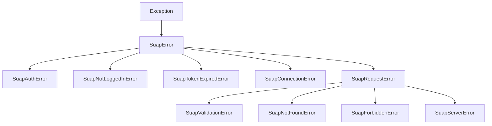

# Exceções

Todas as exceções herdam de `SuapError`, permitindo capturar qualquer erro do wrapper com um único `except SuapError`.

---

## Hierarquia



---

## Referência

| Exceção | Herda de | Status HTTP | Quando ocorre |
|---|---|---|---|
| `SuapError` | `Exception` | — | Base de todas as exceções do wrapper |
| `SuapAuthError` | `SuapError` | 401 (token) | Matrícula ou senha incorretos |
| `SuapNotLoggedInError` | `SuapError` | — | Nenhuma sessão salva encontrada |
| `SuapTokenExpiredError` | `SuapError` | — | Sessão expirada e refresh falhou |
| `SuapConnectionError` | `SuapError` | — | Falha de rede, URL errada, timeout, SSL |
| `SuapRequestError` | `SuapError` | 4xx/5xx | Erro HTTP genérico |
| `SuapValidationError` | `SuapRequestError` | 422 | Parâmetro de tipo ou formato inválido |
| `SuapNotFoundError` | `SuapRequestError` | 404 | Recurso não encontrado |
| `SuapForbiddenError` | `SuapRequestError` | 403 | Sem permissão de acesso |
| `SuapServerError` | `SuapRequestError` | 5xx | Erro interno do servidor SUAP |

---

## Importando as exceções

```python
from suap_api import (
    SuapError,
    SuapAuthError,
    SuapConnectionError,
    SuapTokenExpiredError,
    SuapNotLoggedInError,
    SuapRequestError,
    SuapValidationError,
    SuapNotFoundError,
    SuapForbiddenError,
    SuapServerError,
)
```

---

## Exemplos de tratamento

### Capturar qualquer erro do wrapper

```python
from suap_api import SuapClient, SuapError

try:
    with SuapClient() as client:
        dados = client.comum.get_my_data()
except SuapError as e:
    print(f"Erro: {e}")
```

### Tratamento granular

```python
from suap_api import (
    SuapClient,
    SuapNotLoggedInError,
    SuapTokenExpiredError,
    SuapNotFoundError,
    SuapConnectionError,
)

try:
    with SuapClient() as client:
        aulas = client.edu.get_diary_classes(99999)
except SuapNotLoggedInError:
    print("Execute `suap login` primeiro.")
except SuapTokenExpiredError:
    print("Sessão expirada. Execute `suap login` novamente.")
except SuapNotFoundError:
    print("Diário não encontrado.")
except SuapConnectionError as e:
    print(f"Problema de rede: {e}")
```

### Distinguir erro de autenticação de sessão expirada

```python
from suap_api import SuapAuthError, SuapTokenExpiredError, SuapNotLoggedInError

# SuapAuthError      → senha errada no momento do login
# SuapTokenExpiredError → sessão válida mas expirou depois
# SuapNotLoggedInError  → nunca fez login (nenhum arquivo em ~/.suap/)
```
